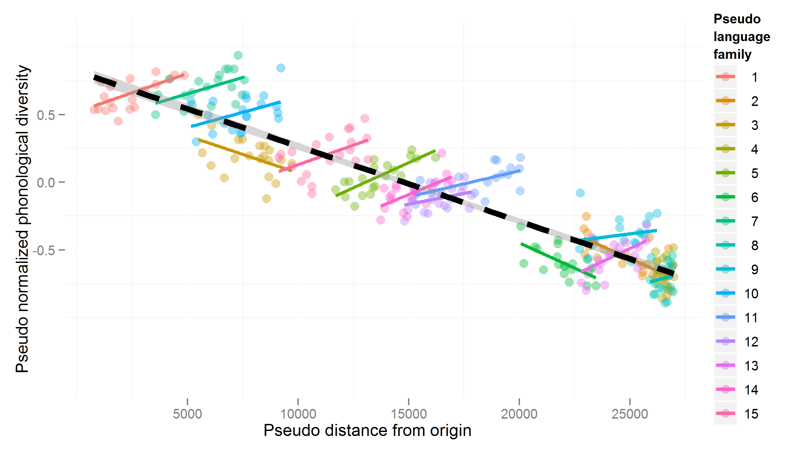
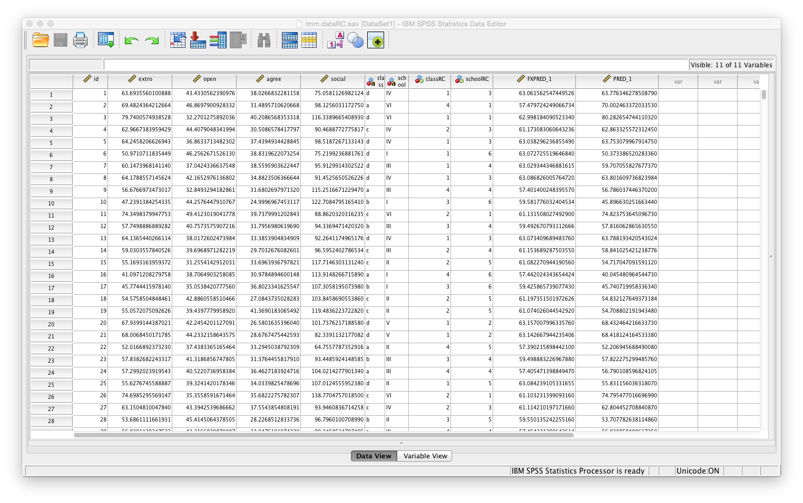
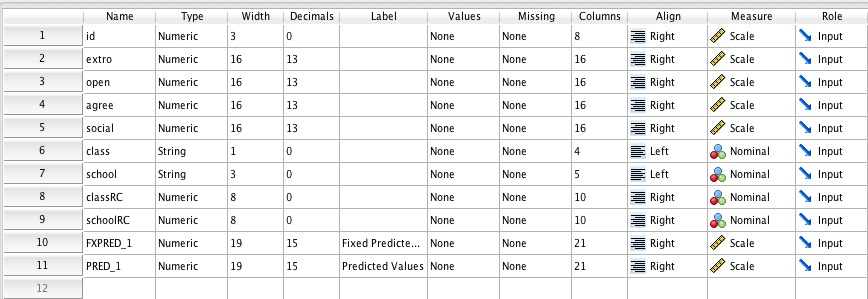
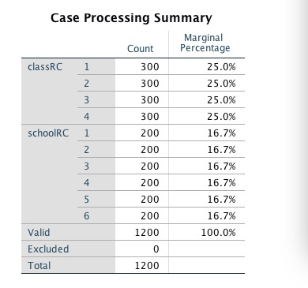
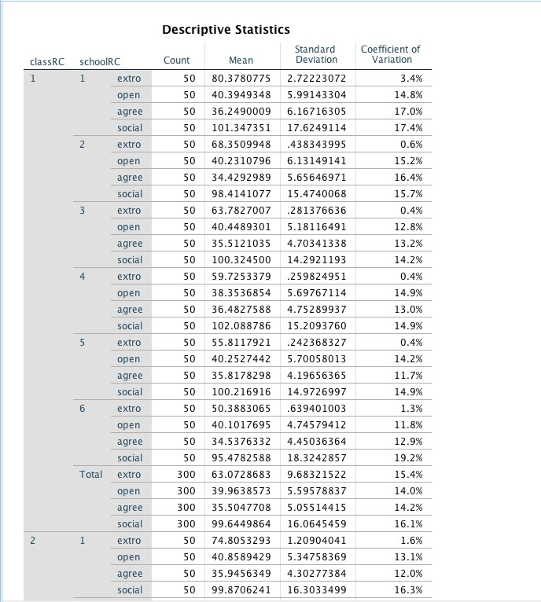
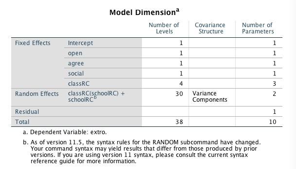
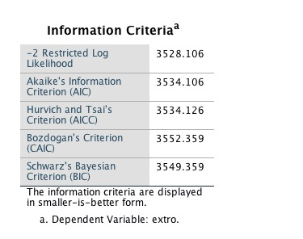
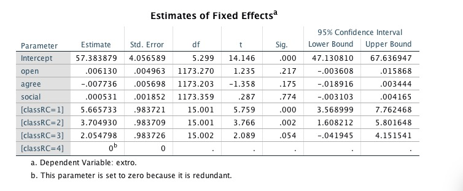
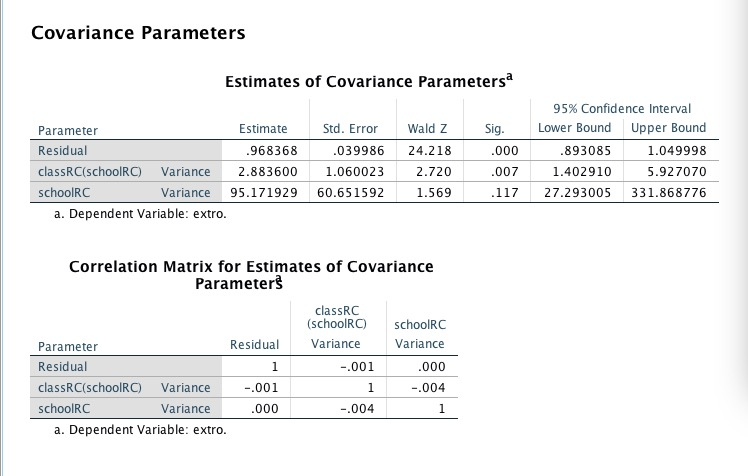

```{r setup, echo=FALSE, warning=FALSE}
library(knitr)
opts_chunk$set(message=FALSE, warning=FALSE, fig.align='center',fig.width=4,out.height="2in",
               fig.height=4, fig.caption=FALSE, cache=TRUE, autodep=TRUE)
```


### Introduce the definition of LMM
Linear mixed effects models simply model the fixed and random effects as having a linear form. Similar to the Generalized Linear Model, an outcome variable is contributed to by additive fixed and random effects (as well as an error term). Using the familiar notation, the linear mixed effect model takes the form: 
\[y_{ij}=b_0+b_1x_{ij}+v_i+\epsilon_{ij}\]

- $y_{ij}$ is the response value for a particular ij case.
- $b_0$ is fixed intercept for regression model.
- $b_1$ is fixed slope for regression model.
- $x_{ij}$ is fixed-effect variable for observation j-th measurement of i-th subject.
- $v_{i}$ is random intercept of i-th  subject.
- $\epsilon_{ij}$ is a Gussian error term which assumed to be multivariate normally distributed.


### Assumption of the models
- The relationship between x and y is linear
- $Y$ is observed random variable.
- $X$ is a design matrix for fixed effect.
- $v_i \sim N(0,\sigma^2_v)$ is an unobserved random noise.
- $\epsilon_{ij} \sim N(0,\sigma^2_\epsilon)$ is an unobserved random noise.
- $v_i$ and $\epsilon_{ij}$ are independent of each other.
- $b_0$ and $b_1$ are unknown constants.


### When and Why LMM is necessary and carried out.


We use Linear Mixed Effect Models when we believe that the data comes from partitions on the sample space, that each partition is internally correlated, and that the partition means are determined by some global parameters plus some noise. This type of situation is illustrated on the graph shown below (image obtained from [here](https://hlplab.wordpress.com/2011/05/31/mixed-models-and-simpsons-paradox/)): 

 


### When and Why LMM is necessary and carried out.

As we can see, the mean within each group follows the larger line, while the data within each group follows it's own sub-population line. In situations like these we might want to be able to make both population and sub-population inferences, or discuss how much the grouping affects the variation. Using an LMM allows us do all of these things. Essentially, we use LMMs when we believe the response variable is sampled from different distributions, the parameters for which are sampled from a parent distribution, and we want our inference to be reflective of this model.


### Statistical Analysis packages
There are several packages in R, which contains for fitting LMMs, for instance nlme, lme4.0, or MCMCglmm. For use in R, it should be noted that lme4 and nlme do not interact well with each other.

```{r,eval=FALSE}
require(lme4)
citation("lme4")
require(nlme)
citation("nlme")
require(MCMCglmm)
citation("MCMCglmm")
```


### Statistical Analysis packages


Two main differences between "lme4" and "nlme":

- "nlme" can only fit outcomes with normal distribution

- "lme4" can use other link functions (e.g. logistic regression)

- "nlme" is flexible with more variance-covariance structures

- "lme4" can only specify diagonal and unstructured covariance matrices


### Perform dataset
We are using the dataset called lmm.dataRC and using SPSS to perform the analysis.
\


### Perform dataset
\


### Perform dataset
- The data contains 1200 cases evenly distributed among 24 nested groups (4 classes within 6 schools). 
- extro: the interval scaled outcome variable Extroversion.
- open: predicted by fixed effects for the interval scaled predictor Openness to new experiences.
- agree: the interval scaled predictor Agreeableness.
- social: the interval scaled predictor Social engagement.
- classRC: the nominal scaled predictor Class. 
- schoolRC: the random (nested) effect of Class (classRC) within School (schoolRC) as well as the random effect of School. 


### Syntax and interpretation of Linear Mixed Effect Model.
The Case Processing Summary simply shows that the cases are balanced among the categories of the categorical variables and no cases were excluded.
\


### Syntax and interpretation of Linear Mixed Effect Model.
Rather large table contains all the descriptive statistics (only the very top of the table is shown here).
\


### Syntax and interpretation of Linear Mixed Effect Model.
The Model Dimension table simply shows the model in terms of which variables (and their number of levels) are fixed and / or random effects and the number of parameters being estimated
\


### Syntax and interpretation of Linear Mixed Effect Model.
The table displays fit indices. For each index; the lower the number, the better the model fits the data.  
  
\


### Syntax and interpretation of Linear Mixed Effect Model.
  This table is our Estimates of Fixed Effect. This is what we'd expect to see in a normal linear regression model with our $\beta$ values, their standard error, degrees of freedom, t-value, significance, and 95% interval.  
\


### Syntax and interpret of Linear Mixed Effect Model.
- The RC variables contain the same information as the original variables, they simply have been recoded.

- SPSS automatically choose the category with the highest numerical value (or the lowest alphabetical letter) as the reference category for categorical variables.

- In the lme4 package in R, the software automatically picks the lowest numerical value (or the earliest alphabetically letter) as the reference category for categorical variables.


### Syntax and interpretation of Linear Mixed Effect Model.

\
  
 
### Syntax and interpretation of Linear Mixed Effect Model.

- The Correlation Matrix for Estimates of Fixed Effects table shows us a similar story as our covariance matrix where we find relatively small and insignificant correlations between our variables except between our classes.  


### Conclusion

- The LMM model is a useful tool when observing both fixed and random effects as in world data.

- In particular, our use of the LMM is able to be useful in addressing nested effects such as with classes within schools.

- To create LMM, SPSS is able to easily build and return descriptive statistics to address the fixed effects.

- In our interpretation of LMM, we have multiple tables to focus on the fixed effects in quantity and confidence intervals as our random effects are known via assumption.

- We should intend to use a LMM when we sample from subgroups which have different distributions determined by the parent group.


### Q&A  


### Reference
- http://bayes.acs.unt.edu:8083/BayesContent/class/Jon/SPSS_SC/Module9/M9_LMM/SPSS_M9_LMM.htm

- http://users.stat.umn.edu/~helwig/notes/lmer-Notes.pdf

- http://www.bodowinter.com/tutorial/bw_LME_tutorial2.pdf


